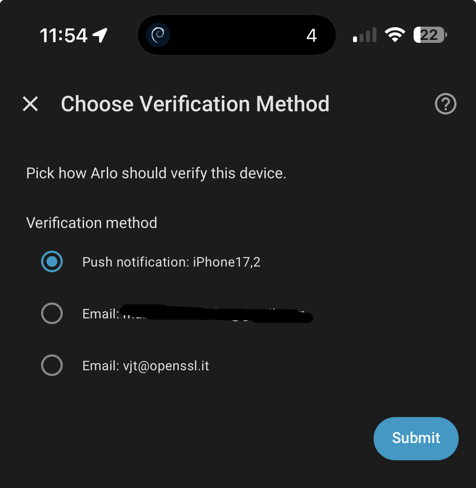

# Eisenberg — Arlo for Home Assistant

[](https://github.com/hacs/integration)
[](https://github.com/vjt/ha-eisenberg/releases)
[](LICENSE)
[](https://github.com/vjt/ha-eisenberg/actions/workflows/ci.yml)
[](https://codecov.io/gh/vjt/ha-eisenberg)

A Home Assistant custom integration for Arlo cameras, named after
skating legend Arlo Eisenberg. Built around event-driven MQTT (no
polling) with a typed Pydantic API client.

📖 Long-form walk-through (UX, auth, MQTT, streaming): **[Eisenberg: Arlo cameras on Home Assistant, the easy way](https://sindro.me/posts/2026-04-28-eisenberg-arlo-on-home-assistant/)** ([🇮🇹 italiano](https://sindro.me/it/posts/2026-04-28-eisenberg-arlo-on-home-assistant/)).

[](https://my.home-assistant.io/redirect/hacs_repository/?owner=vjt&repository=ha-eisenberg&category=integration)

## What you get

- **Live RTSPS streaming** with sub-second lag (forced TCP, ffmpeg
  low-delay flags).
- **Camera entity** with snapshots, motion thumbnails and stream
  keyframes cached on disk so the tile survives restarts and stays
  populated while disarmed.
- **Binary sensors** — generic motion (from MQTT `motionDetected`)
  plus AI-classified person / vehicle / animal detections.
- **Security mode** select — armAway / armHome / standby via Arlo's v3
  location automation API (with revision tracking).
- **Siren switch**.
- **Battery / signal** sensors.
- **Base-station connectivity** binary sensor.
- **Snapshot service** — `eisenberg.snapshot` for dashboard buttons or
  automations.
- **Media archival** — opt-in storage of motion clips, thumbnails and
  stream keyframes to a configured `media_dirs` location, with rolling
  retention (default 14 days).

## Installation

### HACS (recommended)

The fastest path: click the **Open in HACS** badge above. It opens your
HA instance's HACS UI prepared to add this repo as a custom integration
— review and confirm.

Manual HACS path:

1. HACS → Integrations → ⋮ → **Custom repositories** → add
   `https://github.com/vjt/ha-eisenberg` with category **Integration**.
2. Install **Eisenberg (Arlo)**.
3. Restart Home Assistant.
4. Settings → Devices & Services → **Add Integration** → search
   "Eisenberg".

### Manual

Copy `custom_components/eisenberg/` into your HA `custom_components/`
directory, install the `pyeisenberg` Python package into the HA Python
environment, and restart.

## Configuration

The config flow asks for your Arlo email and password.

- If your browser is already trusted at Arlo, login is silent — no
  verification step needed.
- Otherwise, you pick how Arlo should verify this device. Push
  notification, email or SMS — whichever factors your account has
  enabled. Push is fastest; email/SMS is the fallback if the Arlo
  Secure app on your phone hasn't been opened recently.

  

- Push factor: approve the notification on your phone, then click
  **Submit**. Email/SMS factor: type the one-time code Arlo just sent
  you. Each click is a single API call — no polling — so rate-limit
  risk stays low.

After login you pick a media storage location (or **Disabled** to skip
archival).

Already configured? Settings → Devices & Services → **Eisenberg** →
⋮ → **Reconfigure** re-runs the verification step (useful if your
trust cookie expired, or you want to switch factor).

### Options

- **Storage Location** — change the archive directory.
- **Detection sensor reset timeout** — how long person/vehicle/animal
  binary sensors stay on after a detection (default 30 s).
- **Archived media retention** — days to keep on disk (default 14).

## Services

### `eisenberg.snapshot`

Request a fresh full-frame snapshot from a camera. The image arrives
asynchronously via MQTT and refreshes the camera tile. Fails with a
clear error if the camera is in standby (Arlo refuses cloud snapshots
while disarmed).

```yaml
service: eisenberg.snapshot
target:
  entity_id: camera.front_door
```

## Events

The integration fires `eisenberg_media` events on motion detection
with `device_id`, `category`, `categories`, `content_url`,
`thumbnail_url`, `duration`, `timestamp`. Use these in automations to
log clips elsewhere or trigger downstream actions.

## Architecture

- **`eisenberg/`** — pure async Arlo client. REST + raw MQTT 3.1.1
  over WebSocket. Pydantic models for every payload.
- **`custom_components/eisenberg/`** — the HA integration. A single
  coordinator owns the client + MQTT stream and pushes state to
  entities via `_handle_coordinator_update`.

## Why another Arlo integration?

The existing reference is [pyaarlo](https://github.com/twrecked/pyaarlo)
and the HA integration that wraps it. It works, it's been kept alive
heroically, and we owe it the protocol reverse-engineering this client
stands on. But it carries years of accreted workarounds for problems
Arlo has since stopped having:

- **No Cloudflare bypass.** pyaarlo ships `cloudscraper` because the
  old Arlo endpoints were behind a JS challenge. The current
  `ocapi-app.arlo.com` / `myapi.arlo.com` endpoints accept plain
  aiohttp with normal browser headers — the same flow `my.arlo.com`
  uses.
- **No User-Agent spoofing tricks.** We use a vanilla Chrome UA for
  REST and a mobile UA only where Arlo gates RTSP on it (the
  `startStream` endpoint returns DASH for browsers, RTSP for the
  mobile app). Two distinct paths, both documented.
- **No 2FA email polling, no IMAP scraping.** Auth is driven by the
  same browser-trust cookie flow Arlo's own web app uses: one push to
  your phone, one click in HA, then a 14-day trusted-browser cookie.
  No polling, no inbox access, no rate-limit risk from background
  retries.
- **No sync-over-thread-pool fake async.** The whole client is native
  `aiohttp` + `asyncio`. MQTT 3.1.1 is implemented from scratch over
  the existing aiohttp WebSocket session — no `paho-mqtt`, no second
  TCP stack to keep alive.
- **Typed at the boundary.** Every Arlo API/MQTT payload lands in a
  Pydantic model. Unknown shapes log loudly instead of silently
  succeeding — that's how new MQTT topics surfaced during development.

This is a smaller surface (single hardware family, web-auth flow only),
not a drop-in pyaarlo replacement. If you need basestation hubs,
locally-stored video, IMAP 2FA fallback, or any of pyaarlo's broader
device matrix — stay there. If you have a recent battery/solar Arlo
and want a small, typed, event-driven integration you can read end to
end, this is for you.

## Camera support

Tested against the **Arlo Essential XL HD (VMC2052A)** (battery + solar,
WiFi, cloud-only). Other Arlo models that share the same v3 automation
+ MQTT shapes should work — file an issue if yours doesn't.

## Limitations

- All control flows through Arlo's cloud — there's no local API on
  these cameras.
- The trust cookie Arlo issues lasts about 14 days. When it expires,
  HA fires a reauth; one click re-fires a push.

## Development

```bash
./scripts/check.sh    # pyright + pytest + ruff
```

The deploy skill (`/eisenberg-deploy`) pushes to a HAOS box over SSH.
The release skill (`/eisenberg-release`) cuts PyPI + GitHub releases.

## License

MIT.
