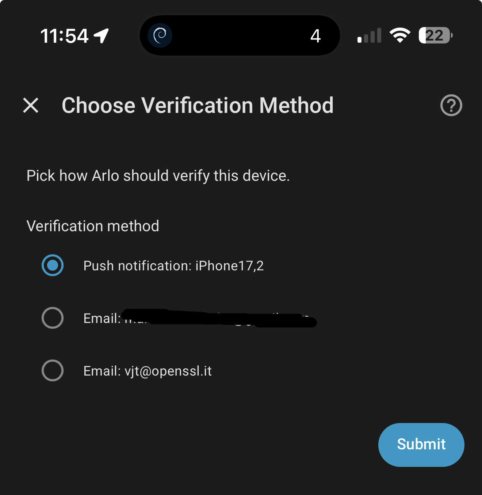

# Eisenberg — Arlo for Home Assistant


[](https://github.com/hacs/integration)
[](https://github.com/vjt/ha-eisenberg/releases)
[](LICENSE)
[](https://github.com/vjt/ha-eisenberg/actions/workflows/ci.yml)
[](https://codecov.io/gh/vjt/ha-eisenberg)

A Home Assistant custom integration for Arlo cameras, named after
skating legend Arlo Eisenberg. Built around event-driven MQTT (no
polling) with a typed Pydantic API client.

📖 Long-form walk-through (UX, auth, MQTT, streaming): **[Eisenberg: Arlo cameras on Home Assistant, the easy way](https://sindro.me/posts/2026-04-28-eisenberg-arlo-on-home-assistant/)** ([🇮🇹 italiano](https://sindro.me/it/posts/2026-04-28-eisenberg-arlo-on-home-assistant/)).

[](https://my.home-assistant.io/redirect/hacs_repository/?owner=vjt&repository=ha-eisenberg&category=integration)

## Entities

Seven platforms. Per camera, unless noted.

| Entity | Platform | What it does |
| --- | --- | --- |
| Camera | `camera` | Live RTSPS stream plus a tile backed by snapshots, motion thumbnails and stream keyframes, cached to disk so it survives restarts and stays populated while disarmed |
| Motion | `binary_sensor` | Generic motion, from the MQTT `motionDetected` property |
| Person / Vehicle / Animal detected | `binary_sensor` | Arlo's AI classification, one sensor per category, with a configurable reset timeout |
| Base station connectivity | `binary_sensor` | Whether the hub that gateways this camera is reachable — resolved by `parentId`, so it reports the camera's *own* hub on multi-hub accounts |
| Battery | `sensor` | Percentage, with the standard HA battery device class |
| Signal strength | `sensor` | WiFi signal, in bars |
| Siren | `switch` | On/off |
| Spotlight | `light` | On/off plus brightness — Arlo's 0–100 intensity mapped onto HA's 0–255 |
| Snapshot | `button` | Request a fresh full-frame snapshot |
| Security mode | `select` | armAway / armHome / standby. **One per location**, named after the location when you have more than one |

Battery and signal work on cameras that report them directly *and* on
cameras that keep them on a hub — see
[Base stations and SmartHubs](#base-stations-and-smarthubs).

## Also in the box

- **Media archival** — opt-in storage of motion clips, thumbnails and
  stream keyframes to a configured `media_dirs` location, with rolling
  retention (default 14 days).
- **An `eisenberg.snapshot` service** for dashboards and automations.
- **`eisenberg_media` events** on every motion capture, for your own
  automations.
- **Multi-location and shared-account support** — devices shared to you
  from somebody else's Arlo account included.
- **Reauthentication that doesn't lose your place** — the integration
  surfaces an auth failure as a proper HA reauth flow instead of going
  quietly deaf, and keeps your trust cookie across it.

## Base stations and SmartHubs

Base-stationed accounts went from unusable to working across 0.3.14–0.4.0
and 0.4.10, driven entirely by bug reports from people who own the
hardware. If you have a VMB-series hub, this is what the integration does
for you:

- **Hubs are gateways, not cameras.** A base station is filtered out of
  the camera platform by `deviceType` — no phantom camera entity whose
  live view can never work. It stays in the device list as a gateway for
  routing, mode control and connectivity.
- **Commands route through the hub.** Arlo rejects snapshot, siren,
  spotlight and stream requests addressed to a camera that sits behind a
  base station (errors `4006` and `2217`). Every per-device command is
  addressed to the controlling `parentId`, with the camera kept as the
  subject of the request.
- **The hub's event stream is registered, and renewed.** Being granted a
  topic by Arlo's MQTT broker is not the same as the hub agreeing to
  talk: an older base station publishes *nothing* until the session is
  explicitly registered with it. The integration registers at startup and
  renews every 25 minutes, because those registrations expire.
- **Hub-held state is pulled, not waited for.** Cameras behind a hub keep
  battery, signal strength and connection state on the hub, which only
  publishes them when asked. The integration asks — at startup and on
  every health tick — and merges partial updates instead of overwriting,
  so a camera's activity frame can't wipe the battery the hub just
  delivered.
- **One xCloudId per hub.** Accounts whose cameras span several base
  stations get a distinct cloud id per hub. Every REST call carries the
  right one, and MQTT subscribes to every hub's topic tree.
- **Partial MQTT refusals are expected, not fatal.** Shared and multi-hub
  accounts routinely get some topic filters refused. The integration
  subscribes to the exact per-device filters Arlo advertises and treats a
  partial refusal as normal.
- **Duplicate hub records are collapsed.** A base station with a built-in
  siren is returned twice by Arlo, as itself and as a `-siren` twin.
- **One mode select per location**, resolved through each hub's
  `gatewayDeviceIds` — including locations shared to you from another
  Arlo account, which live in a different part of the API entirely.

## Installation

### HACS (recommended)

The fastest path: click the **Open in HACS** badge above. It opens your
HA instance's HACS UI prepared to add this repo as a custom integration
— review and confirm.

Manual HACS path:

1. HACS → Integrations → ⋮ → **Custom repositories** → add
   `https://github.com/vjt/ha-eisenberg` with category **Integration**.
2. Install **Eisenberg (Arlo)**.
3. Restart Home Assistant.
4. Settings → Devices & Services → **Add Integration** → search
   "Eisenberg".

### Manual

Copy `custom_components/eisenberg/` into your HA `custom_components/`
directory, install the `pyeisenberg` Python package into the HA Python
environment, and restart.

## Configuration

The config flow asks for your Arlo email and password.

**Since 6 October 2026, Arlo has two-step verification disabled
service-wide** — the 2FA settings are gone from the Arlo Secure app and
from my.arlo.com. While that holds, setup is just email and password:
there is no second factor to satisfy and the integration doesn't ask for
one. If Arlo turns it back on, the flow below returns automatically.

When MFA is live:

- If your browser is already trusted at Arlo, login is silent — no
  verification step needed.
- Otherwise, you pick how Arlo should verify this device. Push
  notification, email or SMS — whichever factors your account has
  enabled. Push is fastest; email/SMS is the fallback if the Arlo
  Secure app on your phone hasn't been opened recently.

  

- Push factor: approve the notification on your phone, then click
  **Submit**. Email/SMS factor: type the one-time code Arlo just sent
  you. Each click is a single API call — no polling — so rate-limit
  risk stays low.

After login you pick a media storage location (or **Disabled** to skip
archival).

Already configured? Settings → Devices & Services → **Eisenberg** →
⋮ → **Reconfigure** re-runs the verification step (useful if your
trust cookie expired, or you want to switch factor).

### Options

- **Storage Location** — change the archive directory, or disable
  archival.
- **Detection sensor reset timeout** — how long person/vehicle/animal
  binary sensors stay on after a detection (default 30 s).
- **Archived media retention** — days to keep on disk (default 14).
- **Route stream through ffmpeg** — off by default. Home Assistant's
  go2rtc reads Arlo's RTSPS natively, in-process, with HEVC passthrough.
  Turn this on only if live view comes up black on your camera, which
  means go2rtc's native RTSP client can't read that particular stream;
  it costs an extra remux hop.

## Streaming

Live view is RTSP-over-TLS on port 443, forced to TCP with low-delay
decoder flags, which is what keeps lag sub-second. Arlo gates the
protocol on the User-Agent: a browser UA gets DASH, a mobile UA gets
RTSP, so the stream call — and only the stream call — presents a mobile
UA.

An Arlo stream URL is valid only for the session that minted it, which
is unlike an ordinary RTSP camera and trips up Home Assistant's
assumption that a camera's source is stable. The integration therefore
serialises concurrent stream requests onto a single Arlo session,
reuses a fresh URL briefly rather than waking the camera twice, and
drops the cached stream as soon as its session ends — so the next viewer
gets a live URL instead of a dead one.

## Services

### `eisenberg.snapshot`

Request a fresh full-frame snapshot from a camera. The image arrives
asynchronously via MQTT and refreshes the camera tile. Fails with a
clear error if the camera is in standby (Arlo refuses cloud snapshots
while disarmed).

```yaml
service: eisenberg.snapshot
target:
  entity_id: camera.front_door
```

## Events

The integration fires `eisenberg_media` events on motion detection
with `device_id`, `category`, `categories`, `content_url`,
`thumbnail_url`, `duration`, `timestamp`. Use these in automations to
log clips elsewhere or trigger downstream actions.

## Architecture

- **`eisenberg/`** — pure async Arlo client. REST + raw MQTT 3.1.1
  over WebSocket. Pydantic models for every payload.
- **`custom_components/eisenberg/`** — the HA integration. A single
  coordinator owns the client + MQTT stream and pushes state to
  entities via `_handle_coordinator_update`.

MQTT is the primary data source, not a supplement: REST is used for
commands and for discovery, and everything else arrives as an event. The
periodic tick exists only for the things that genuinely need a clock —
token refresh, hub re-registration, media pruning, MQTT reconnection.

## Why another Arlo integration?

The existing reference is [pyaarlo](https://github.com/twrecked/pyaarlo)
and the HA integration that wraps it. It works, it's been kept alive
heroically, and we owe it the protocol reverse-engineering this client
stands on. But it carries years of accreted workarounds for problems
Arlo has since stopped having:

- **No Cloudflare bypass.** pyaarlo ships `cloudscraper` because the
  old Arlo endpoints were behind a JS challenge. The current
  `ocapi-app.arlo.com` / `myapi.arlo.com` endpoints accept plain
  aiohttp with normal browser headers — the same flow `my.arlo.com`
  uses.
- **No User-Agent spoofing tricks.** We use a vanilla Chrome UA for
  REST and a mobile UA only where Arlo gates RTSP on it (the
  `startStream` endpoint returns DASH for browsers, RTSP for the
  mobile app). Two distinct paths, both documented.
- **No 2FA email polling, no IMAP scraping.** Auth is driven by the
  same browser-trust cookie flow Arlo's own web app uses: one push to
  your phone, one click in HA, then a 14-day trusted-browser cookie.
  No polling, no inbox access, no rate-limit risk from background
  retries.
- **No sync-over-thread-pool fake async.** The whole client is native
  `aiohttp` + `asyncio`. MQTT 3.1.1 is implemented from scratch over
  the existing aiohttp WebSocket session — no `paho-mqtt`, no second
  TCP stack to keep alive.
- **Typed at the boundary.** Every Arlo API/MQTT payload lands in a
  Pydantic model. Unknown shapes log loudly instead of silently
  succeeding — that's how new MQTT topics surfaced during development.

This is still a smaller surface than pyaarlo's and not a drop-in
replacement: there's no locally-stored video, no IMAP 2FA fallback, and
the device matrix is narrower. Base stations, however, are no longer on
that list — see above.

## Hardware support

The only hardware the author owns is an **Arlo Essential XL HD
(VMC2052A)** — battery + solar, WiFi, cloud-only. Everything else below
works because somebody filed a bug report, sent a debug log, and
confirmed the fix on their own account. That is the honest provenance,
and it's worth saying out loud.

| Hardware | How it got supported |
| --- | --- |
| Essential XL HD (VMC2052A) | Author's own camera; the development rig |
| 2K Essential XL (VMC3052A) | Reported black live view; fixed via the ffmpeg stream option |
| Pro 2 base station (VMB4000) | Reported, diagnosed and fixed across several releases |
| Ultra / Pro 3 SmartHub (VMB5000) | Reported; hub registration and state pull field-confirmed by the reporter |
| Ultra (VMC5040) | Behind a VMB5000, same reports |
| Pro-series cameras (VMC4030, VMC4060) | Behind hubs, in reporters' accounts |
| Video Doorbell (FB1001A) | Publishes on a separate `doorbells` resource, handled |

Device *types* are handled generically — `basestation`, `arlobridge` and
`hub` are treated as gateways; `camera`, `doorbell` and `arloq` as
cameras — so a model not listed here stands a good chance of working.
**If yours doesn't, file an issue with a debug log.** Every row in that
table above the first one exists because somebody did.

## Limitations

- All control flows through Arlo's cloud — there's no local API on
  these cameras.
- Arlo refuses on-demand snapshots while a camera is in standby. The
  tile keeps showing the last cached image instead.
- When Arlo has MFA enabled, the trust cookie it issues lasts about 14
  days. When it expires, HA fires a reauth; one click re-fires a push.
- Arlo changes things without notice — they disabled MFA service-wide on
  6 October 2026 and broke every third-party client within the hour. If
  the integration suddenly can't log in, check the issue tracker before
  assuming it's your account.

## Development

```bash
./scripts/check.sh    # pyright + pytest + ruff
```

The deploy skill (`/eisenberg-deploy`) pushes to a HAOS box over SSH.
The release skill (`/eisenberg-release`) cuts PyPI + GitHub releases.

## License

MIT.
